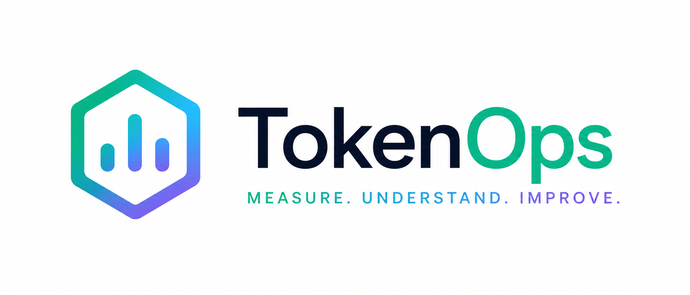

<p align="center">
  <picture>
    <source media="(prefers-color-scheme: dark)" srcset="docs/brand/logo-mark-dark.png">
    
  </picture>
</p>

<p align="center">
  
  
  
  
</p>

# TraceYield

**TraceYield** is a closed-loop discipline for managing the **cost and efficacy of LLM interactions**: FinOps, but for coding-agent spend. The token is its unit of account, but the thing it manages is the *interaction*: prompt, reasoning, response. It runs a loop over that material, **describe → diagnose → predict → prescribe → remediate**, so a team gets steadily cheaper *and* more effective at using coding agents over time. See [`docs/traceyield-framework.md`](./docs/traceyield-framework.md) for the full framework.

**traceyield** (lowercase, this repo) is the reference tool that implements it. Today it parses your local [Claude Code](https://claude.com/claude-code) transcripts and produces a **self-contained, interactive HTML dashboard**, no server, no build step, no dependencies (Python stdlib only), covering the **describe** and **diagnose** rungs of the ladder, with a first **prescribe** lever (routing-savings estimator) shipped.

Because every transcript line is timestamped, a single run reconstructs your **entire history** bucketed by activity date. Day / week / month aggregation happens client-side in the report, so you can step through any period and watch trends move.

```
python report.py
# Machine: dt-6cpyln3 -> .../machines/dt-6cpyln3
# 30 active days (2026-05-28..2026-07-10) | $5,409.92 | 36,622 turns | 662/18524 tool errors (3.6%)
# 117 sessions | priciest $353.90 (kinderos)
# Report: machines/dt-6cpyln3/report.html
```

Open the `report.html` in your machine's folder under `machines/` in any browser.

### Per-machine data

Each machine has its own `~/.claude/projects`, so every machine's generated artifacts, `daily_metrics.json`, `session_metrics.json`, `report.html`, `run.log`, are written under **`machines/<machine-id>/`**, keyed by the sanitized hostname, so runs on different machines never overwrite each other. Set the `TRACEYIELD_MACHINE` env var to override the folder name (e.g. to make a machine merge into an existing folder).

**`machines/` is git-ignored**: your report and metrics stay local to your machine and are never committed, so cloning this repo never carries anyone else's usage data. Just clone and run; you get your own report. `pricing_history.json` is the one generated file that *is* committed: it's non-personal (dates + Anthropic's public rates) and shared at the repo root so the pricing-over-time chart has history on a fresh clone.

## What it shows

- **KPI cards**: cost, total tokens, assistant turns, sessions, and tool-error rate for the selected period, each with a delta vs. the previous period.
- **Trend chart**: step through day/week/month and switch the metric (cost, tokens, turns, error rate, sessions).
- **Cost breakdowns**: by project, by model tier, and the five-line **token composition** (fresh input, cache write 5m/1h, cache read, output) that shows where the money actually goes.
- **Per-session cost analysis**: a "Top sessions by cost" table across all history, to catch a single **runaway conversation** (usually a long, uncleared context that gets re-read every turn).
- **Model-routing savings estimator**: recomputes a period's **Opus** token usage at Sonnet/Haiku rates, scaled by a "how much is safely routable" input, to estimate what `/model` routing would save. Framed as an upper bound.
- **Tokens & cost per tool**: full turn cost attributed to its single tool (Claude Code serializes tool calls, so this is exact for tool turns), plus an **estimated-waste** column that puts a dollar figure on tool errors.
- **Error taxonomy & fixes**: tool failures classified into recurring patterns (Write/Edit-before-Read, Windows shell mismatches, stale edits, permission denials, …) each paired with a concrete remediation.
- **Model pricing over time**: rates are stamped daily so you can see how they moved; all historical cost is computed at *current* rates for apples-to-apples comparison.

The report has a built-in **"How to read this report"** section explaining the token economics and how to use the numbers to cut spend.

## Install & run

Requires Python 3 (stdlib only, nothing to `pip install`).

```bash
git clone https://github.com/DecoupledLogic/traceyield.git
cd traceyield
python report.py
```

It reads transcripts from `~/.claude/projects` and writes this machine's `report.html` under `machines/<machine-id>/`.

### Run it daily (Windows)

`run.cmd` is a Task Scheduler wrapper that runs the report and appends a one-line summary to this machine's `run.log`. It's portable: it locates the repo from its own path and the per-machine folder via `report.py --machine-dir`, so no editing is needed. If `python` isn't on PATH, set `PYTHON` to your interpreter (e.g. `set PYTHON=C:\Users\you\anaconda3\python.exe`) before scheduling. Point a daily scheduled task at it:

```
schtasks /create /tn "TraceYield Usage Report" /tr "C:\path\to\traceyield\run.cmd" /sc daily /st 09:00
```

On macOS/Linux, wire `python report.py` into a `cron` job or `launchd` agent.

## How it works

Each run:

1. **Parses** every `*.jsonl` under `~/.claude/projects`, bucketing metrics by the UTC activity date of each message/tool-result. Malformed lines and files are skipped so one bad transcript can't abort a run.
2. **Merges** new day-buckets into `daily_metrics.json` and sessions into `session_metrics.json`: the newest parse is authoritative per date/session, and dates/sessions whose transcripts have since rotated away are preserved.
3. **Records** today's model pricing into the shared `pricing_history.json` at the repo root.
4. **Emits** `report.html`: the full dataset is inlined into a single self-contained file.

Everything lives in one file, `report.py`: config, parser, persistence, and the entire HTML/CSS/JS template.

### Pricing

Base per-1M-token rates live in the `PRICING` dict at the top of `report.py`. Edit it when Anthropic changes prices. Cache multipliers are fixed by the API (read 0.1×, write-5m 1.25×, write-1h 2× the input rate). Changing `PRICING` recomputes *all* historical cost at the new rates, by design.

## Tests

Stdlib `unittest`, no dependencies:

```bash
python -m unittest test_report          # or: python -m pytest test_report.py -q
```

The suite builds fixture transcripts with hand-computable token counts and checks exact costs, session accumulation, the per-tier token breakdown the routing estimator depends on, merge semantics, the error taxonomy, and HTML generation.

## Files

| File | Role |
|------|------|
| `report.py` | The whole tool: parser, persistence, and HTML template |
| `test_report.py` | Test suite |
| `run.cmd` | Portable Windows daily-runner wrapper |
| `pricing_history.json` | Daily snapshots of model pricing, **committed** (shared, non-personal) |
| `machines/<id>/report.html` | Generated dashboard for that machine (open this), *git-ignored* |
| `machines/<id>/daily_metrics.json` | That machine's durable per-day metrics store, *git-ignored* |
| `machines/<id>/session_metrics.json` | That machine's durable per-session metrics store, *git-ignored* |
| `machines/<id>/run.log` | That machine's daily-runner log, *git-ignored* |

Everything under `machines/` is generated and **git-ignored**: it stays local to each machine (see [Per-machine data](#per-machine-data)). Only `pricing_history.json` is a committed generated artifact. Each machine gets its own `machines/<machine-id>/` folder on first run.

---

Built by [DecoupledLogic](https://github.com/DecoupledLogic).
